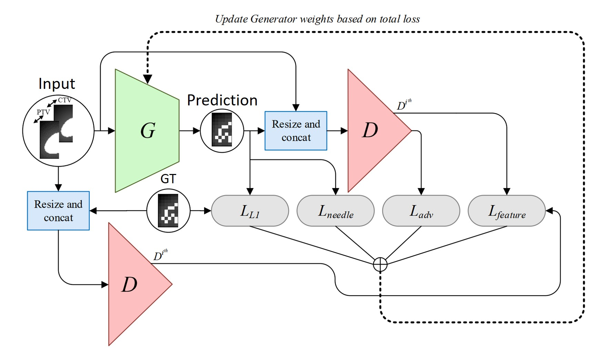

# Centre-specific autonomous treatment plans for prostate brachytherapy using cGANs

Keras/Tensorflow implementation of 3D pix2pix for automating seed planning for prostate brachytherapy. This work is published in International Journal of Computer Assisted Radiology and Surgery (2021) and will be presented in [IPCAI 2021](http://www.ipcai.org/).

<a href="https://rdcu.be/cmKMD" target="_blank">Paper |</a>
<a href="https://youtu.be/F5kOCjiZpR4" target="_blank">Presentation |</a>

<p align="left">
<a href="#"></a>
</p>

### Dependencies
```
Python 3.6
Tensorflow: 2.0.0
Keras: 2.3.1
```

### Environment Setup

Recreate conda environment as follows:
```
conda env create -f environment.yml
```

Or if you are using Docker:
```
docker pull tazleef/tf2.0.0-cv-keras2.3.1-imgaug:latest
```

### Training

Due to privacy policy, we are unable to share our clinical dataset. However, we have included a few sample cases for reference. Format your centre's dataset in the same way and set the filepath and training parameters in `train.py`. 

To train the model, run `train.py` with . 

This code can be used for other 3D image to image translation task by modifying the network architechtures according to the data dimensions. 

### Citation
```
@article{aleef2021centre,
  title={Centre-specific autonomous treatment plans for prostate brachytherapy using cGANs},
  author={Aleef, Tajwar Abrar and Spadinger, Ingrid T and Peacock, Michael D and Salcudean, Septimiu E and Mahdavi, S Sara},
  journal={International Journal of Computer Assisted Radiology and Surgery},
  pages={1--10},
  year={2021},
  publisher={Springer}
}
```
### Contact 

If you face any problem using this code then please create an issue in this repository or contact me at [tajwaraleef@ece.ubc.ca](mailto:tajwaraleef@ece.ubc.ca?subject=[GitHub]%3Dpix2pix%20Issue%20)

### Acknowledgements

The 3D Resnet code is based on [https://github.com/JihongJu/keras-resnet3d](https://github.com/JihongJu/keras-resnet3d)

### License
MIT

